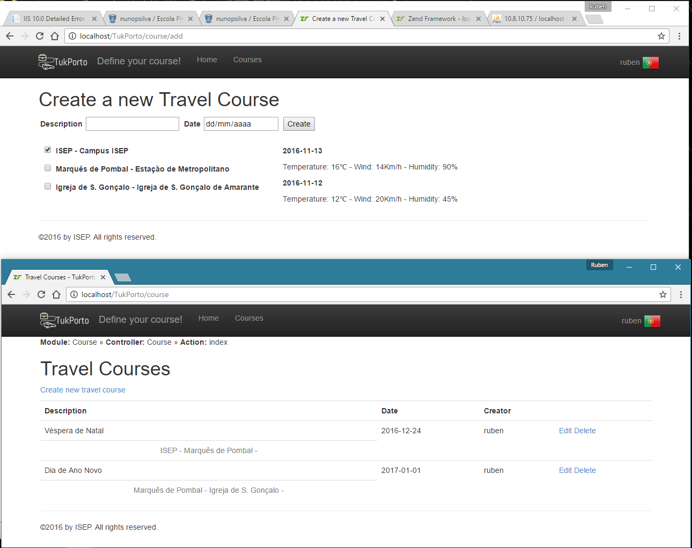

# TukPorto

This is an academic project that consisted in the development of a Points Of Interest (POI) management system, with user (tourist) management and courses creation and edition.
The system also used an external REST API to fetch POI weather information.

